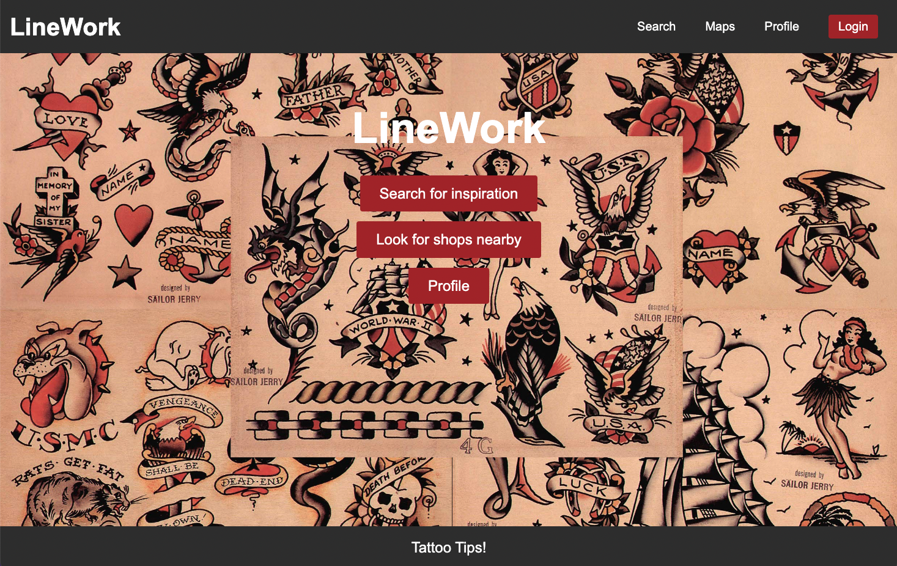

# Linework

## Deployed Application
[Click here to go to our deployed application](https://linework-bcs-455ff424ffbc.herokuapp.com/#/)

## Table of Contents

* [Description](#description)
* [Technologies Used](#technologies-used)
* [Webpage Access](#webpage-access)
* [Contributors](#contributors)

## Description

Looking to find some inspiration for your next tattoo? Look no further! 

In this application, our group worked to create an application where you can look up pictures for tattoo inspiration or use google maps to search tattoo shops in the city of your choice. The user can utilize the website without an account, or create and account in order to save pictures to their profile for later. If the user is unhappy with a photo they chose or end up getting it as their tattoo, they have the ability to delete it off their profile. 

## Technologies Used

- React.JS

- Node.js 

- Express.js 

- GraphQL

- MongoDB and the Mongoose ODM for the database.

- Queries and Mutations for retrieving, adding, updating, and deleting data.

- Heroku deployment

- JWT Authentication 

- Google Maps & Unslpash APIs

## Webpage Access
 - [Github Repository](https://github.com/b-locatelli/linework)
 - [Deployed Webpage](https://linework-bcs-455ff424ffbc.herokuapp.com)
 - [Class Presentation](https://docs.google.com/presentation/d/1D5L2uZ_X_bvArUm5rxSoI2SVf9hXKw-nNRp_w9YcWrs/edit#slide=id.p25)

### Contributors
- Sydney Birza's [GitHub](https://github.com/sydKB?tab=repositories)
- Baily Locatelli's [GitHub](https://github.com/b-locatelli?tab=repositories)
- Seth Phelps's [GitHub](https://github.com/sethaphelps?tab=repositories)
- Hans Van Housen's [GitHub](https://github.com/HansVanHousen)
- Jaswinder Singh's [GitHub](https://github.com/jaswindersinghsaini?tab=repositories)
